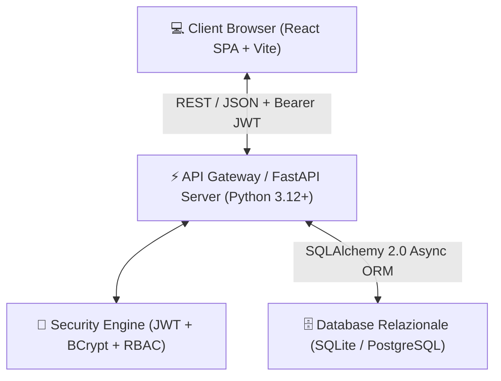
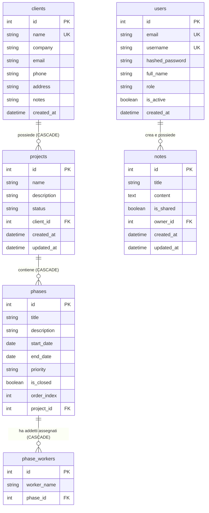

# 🛠️ Documentazione Tecnica — HiPlan

Questo documento fornisce una panoramica architetturale, tecnica e strutturale completa di **HiPlan**, rivolta agli sviluppatori, ingegneri del software e system administrator che intendono comprendere a fondo il funzionamento interno, il modello relazionale, le API REST e le scelte progettuali del sistema.

---

## 📐 1. Panoramica dell'Architettura

Il sistema adotta un'architettura **Client-Server disaccoppiata**, composta da un backend **RESTful API** ad alte prestazioni scritto in Python (FastAPI) e un frontend interattivo Single Page Application (SPA) scritto in **React + Vite**.



### 🎯 Principi Guida del Design

- **Nessuna dipendenza da librerie esterne proprietarie (Gantt Custom)**: Al fine di garantire la massima flessibilità, reattività e assenza di costi di licenza, il diagramma di Gantt e la timeline temporale interattiva sono realizzati interamente tramite componenti React nativi (`Custom Gantt Grid`) con calcolo dinamico delle posizioni e gestione interattiva.
- **Stile Notion-like Editor**: Il modulo **Blocchi Note** implementa un editor visuale WYSIWYG basato sulle API del DOM (`contentEditable`) in grado di convertire automaticamente la sintassi Markdown in blocchi visuali (Titoli, Check-list interattive, Citazioni, Blocco Codice) e di sincronizzare lo stato sul server con debouncing.
- **Eager Loading e Integrità Relazionale**: Il backend utilizza `SQLAlchemy 2.0` con caricamento esplicito delle relazioni (`selectinload`) per evitare il problema delle query _N+1_ e garantire risposte serializzate complete ed efficienti in Pydantic.

---

## 🗄️ 2. Schema Relazionale del Database (ER Diagram)

Il database è strutturato su un modello relazionale normalizzato. In ambiente di sviluppo locale utilizza **SQLite** (`ganttflow.db`), mentre in produzione tramite Docker si interfaccia nativamente con **PostgreSQL**.



### Dettaglio delle Tabelle Principali

1. **`users` (Utenti del sistema e credenziali)**
   - `role`: Campo stringa che definisce i privilegi (`admin`, `pm`, `viewer` / `worker`).
   - Il primo utente registrato sulla piattaforma assume automaticamente il ruolo di `admin`.
2. **`clients` (Anagrafica Clienti)**
   - Contiene i dati anagrafici societari e di contatto cui sono associati i progetti.
3. **`projects` (Commesse / Progetti Aziendali)**
   - Raggruppa le fasi di lavorazione. Ha una relazione `client_id` con eliminazione a cascata (`CASCADE`).
4. **`phases` (Fasi Operative e Dipendenze temporali)**
   - Rappresenta le attività temporali visualizzate sul diagramma di Gantt e sul Calendario.
   - `start_date` / `end_date`: Intervallo temporale di lavorazione della fase.
   - `priority`: Livello prioritario (`Bassa`, `Media`, `Alta`, `Critica`) che determina la colorazione visiva e la marcatura d'urgenza.
   - `is_closed`: Booleano che indica la chiusura o il completamento della fase.
5. **`phase_workers` (Assegnazione Addetti alle Fasi)**
   - Tabella di collegamento dinamica che associa uno o più addetti alle singole fasi operative. Consente il filtraggio granulare nel modulo Calendario.
6. **`notes` (Blocchi Note — Notebook Interattivo)**
   - `content`: Testo strutturato HTML/Markdown generato dal modulo editor in stile Notion.
   - `is_shared`: Booleano che determina la visibilità (`false` per nota privata, `true` per nota condivisa con l'intero team).

---

## 🔐 3. Sicurezza e Controllo degli Accessi (Auth & RBAC)

L'autenticazione è gestita tramite uno schema di sicurezza stateless ad alta affidabilità basato su **JSON Web Tokens (JWT)**.

- **Hashing Password**: Utilizzo della libreria industriale `passlib[bcrypt]` con salt univoco per impedire attacchi a dizionario o rainbow table.
- **Flusso dei Token**:
  - Al login (`POST /api/auth/login`), il backend rilascia una coppia di token:
    - **Access Token** (scadenza breve, es. 30/60 minuti): Inviato nell'header `Authorization: Bearer <token>`.
    - **Refresh Token** (scadenza lunga, es. 7 giorni): Mantenuto per il rinnovo automatico senza interruzioni di sessione.
- **Role-Based Access Control (RBAC)**:
  - Implementato nel layer di dipendenza FastAPI (`get_current_active_user`, `check_admin_role`).
  - **`admin`**: Accesso totale in lettura/scrittura a tutti gli endpoint, gestione utenti del sistema, gestione anagrafica addetti (`/api/users/workers`).
  - **`pm`**: Creazione e modifica di clienti, commesse, fasi e addetti collegati; accesso al calendario e alle proprie note private o condivise.
  - **`viewer` / `worker`**: Accesso in sola lettura a progetti e calendario, con possibilità di operare sulle proprie note personali o consultare quelle condivise dal team.

---

## 💻 4. Stack Tecnologico del Backend (`backend/`)

### Librerie Core e Funzioni

- **FastAPI**: Framework web asincrono ad altissime prestazioni per la gestione delle richieste HTTP e validazione automatica basata su typing Python.
- **SQLAlchemy 2.0 (AsyncEngine & AsyncSession)**: ORM di ultima generazione con sintassi dichiarativa `Mapped` e `mapped_column`.
- **Pydantic V2 (`ConfigDict(from_attributes=True)`)**: Serializzazione ad alta velocità dei dati ORM in payload JSON validati rigorosamente.
- **Uvicorn**: Server ASGI per l'esecuzione del codice Python asincrono.

### Struttura dei File del Backend

```
backend/
├── app/
│   ├── main.py              # Entry point FastAPI, configurazione CORS e inclusione Router
│   ├── api/                 # Moduli di rotte REST
│   │   ├── auth.py          # /api/auth (login, register, me, refresh)
│   │   ├── users.py         # /api/users (gestione utenti e anagrafica addetti)
│   │   ├── clients.py       # /api/clients (CRUD clienti)
│   │   ├── projects.py      # /api/projects (CRUD commesse e calcolo progresso)
│   │   ├── phases.py        # /api/phases (CRUD fasi operative e addetti assegnati)
│   │   └── notes.py         # /api/notes (CRUD blocchi note e permessi di visibilità)
│   ├── core/
│   │   ├── config.py        # Settings e variabili d'ambiente (.env)
│   │   ├── database.py      # Configurazione AsyncEngine, get_db e Base metadata
│   │   └── security.py      # Funzioni di hashing bcrypt e generazione token JWT
│   ├── models/              # Classi SQLAlchemy (User, Client, Project, Phase, PhaseWorker, Note)
│   └── schemas/             # Classi Pydantic (Create, Update, Out per ogni risorsa)
└── requirements.txt         # Dipendenze Python
```

---

## 🎨 5. Stack Tecnologico del Frontend (`frontend/`)

### Librerie Core e Funzioni

- **React 18**: Libreria UI reattiva con gestione stato avanzata tramite Hook (`useState`, `useEffect`, `useCallback`, `useMemo`, `useRef`).
- **Vite**: Build tool e dev server rapidissimo con Hot Module Replacement (HMR).
- **React Router DOM 6**: Gestione delle rotte lato client e protezione delle sezioni tramite componente wrapper (`ProtectedRoute`).
- **Axios (`api/client.js`)**: Client HTTP configurato con interceptor per l'iniezione automatica del token JWT in ogni richiesta e gestione centralizzata del refresh token in caso di errore `401 Unauthorized`.
- **Vanilla CSS (Design System Tokenizzato)**: Sistema di stili CSS flessibile e performante (senza sovraccarichi di framework esterni), organizzato con variabili CSS globali per un tema **Dark Mode Premium** (Glassmorphism, gradienti armoniosi, micro-animazioni fluide `animate-fadeIn`).

### Moduli Frontend e Rotte

- `MainLayout.jsx`: Layout principale con barra laterale collassabile, icone geometriche coerenti (`◫`, `☰`, `▦`, `▤`, `⚙`) e informazioni profilo.
- `DashboardPage.jsx` (`/`): Panoramica KPI ad alto impatto visivo con contatori e fasi in scadenza imminente.
- `ProjectsPage.jsx` (`/projects`): Catalogo commesse filtrate per cliente, ricerca e stato di completamento.
- `ProjectDetailPage.jsx` (`/projects/:id`): Scheda commessa con:
  - **Vista Lista / Dettaglio Fasi**: Creazione e modifica delle fasi temporali con assegnazione dinamica addetti (`phase_workers`).
  - **Vista Gantt & Timeline Interattiva**: Griglia temporale custom con zoom istantaneo su **Giorni**, **Settimane** o **Mesi**, posizionamento dinamico delle barre delle fasi e indicazione visiva della priorità e del completamento.
- `CalendarPage.jsx` (`/calendar`): Calendario operativo mensile in stile griglia che mostra le fasi lavorative attive su ogni giornata, dotato di un selettore per filtrare le attività per singolo **Addetto Operativo**.
- `NotesPage.jsx` (`/notes`): Modulo **Blocchi Note stile Notion** con editor ricco `contentEditable`, barra di formattazione rapida, ricerca testuale, filtri per schede (`Tutte`, `🔒 Private`, `👥 Condivise`) e menu a discesa istantaneo _"Modifica ▼"_ per la visibilità del file.
- `AdminPage.jsx` (`/admin`): Pannello di gestione riservato agli amministratori per il controllo dei ruoli utente e della lista centralizzata degli addetti assegnabili.

---

## 📡 6. Endpoint API REST (Riferimento Rapido)

| Metodo   | Endpoint                    | Descrizione                                 | Permessi                     |
| :------- | :-------------------------- | :------------------------------------------ | :--------------------------- |
| `POST`   | `/api/auth/register`        | Registrazione nuovo account                 | Pubblico (1° utente = Admin) |
| `POST`   | `/api/auth/login`           | Autenticazione e rilascio token JWT         | Pubblico                     |
| `GET`    | `/api/auth/me`              | Dati utente connesso                        | Autenticato                  |
| `GET`    | `/api/clients`              | Lista clienti registrati                    | Autenticato                  |
| `POST`   | `/api/clients`              | Creazione nuovo cliente                     | Admin / PM                   |
| `GET`    | `/api/projects`             | Lista commesse aziendali                    | Autenticato                  |
| `POST`   | `/api/projects`             | Creazione nuova commessa                    | Admin / PM                   |
| `GET`    | `/api/projects/{id}`        | Dettaglio commessa + Fasi collegate         | Autenticato                  |
| `POST`   | `/api/phases`               | Aggiunta fase alla commessa + Addetti       | Admin / PM                   |
| `PATCH`  | `/api/phases/{id}`          | Modifica date, priorità, chiusura o addetti | Admin / PM                   |
| `DELETE` | `/api/phases/{id}`          | Rimuove la fase e i relativi addetti        | Admin / PM                   |
| `GET`    | `/api/notes`                | Lista appunti personali e condivisi         | Autenticato                  |
| `POST`   | `/api/notes`                | Creazione nuovo blocco note                 | Autenticato                  |
| `PATCH`  | `/api/notes/{id}`           | Modifica testo o visibilità (`is_shared`)   | Autore o Admin               |
| `DELETE` | `/api/notes/{id}`           | Eliminazione blocco note                    | Autore o Admin               |
| `GET`    | `/api/users/workers`        | Lista anagrafica addetti operativi          | Autenticato                  |
| `POST`   | `/api/users/workers`        | Aggiunta nuovo addetto al database          | Admin                        |
| `DELETE` | `/api/users/workers/{name}` | Rimozione addetto dall'anagrafica           | Admin                        |

---

## ⚙️ 7. Guida all'Installazione e Sviluppo

### Requisiti di Sistema

- **Python 3.12+**
- **Node.js 18+ & NPM 9+**
- **Git**

### 1. Configurazione e Avvio del Backend

```bash
# Entra nella cartella backend
cd backend

# Crea l'ambiente virtuale
python3 -m venv venv
source venv/bin/activate  # Su Windows: venv\Scripts\activate

# Installa le dipendenze
pip install -r requirements.txt

# Configura il file .env (opzionale se usi i valori di default in locale)
echo "SECRET_KEY=supersecretkey_per_sviluppo_locale_12345" > .env
echo "DATABASE_URL=sqlite+aiosqlite:///./ganttflow.db" >> .env

# Avvia il server di sviluppo con hot-reload
python -m uvicorn app.main:app --host 0.0.0.0 --port 8000 --reload
```

Il backend sarà operativo su `http://localhost:8000`. La documentazione interattiva OpenAPI/Swagger è accessibile su `http://localhost:8000/docs`.

### 2. Configurazione e Avvio del Frontend

```bash
# Entra nella cartella frontend (da un nuovo terminale)
cd frontend

# Installa i pacchetti Node
npm install

# Avvia il server di sviluppo Vite
npm run dev
```

L'interfaccia React sarà raggiungibile su `http://localhost:5173`. Any API call verso `/api` è automaticamente instradata verso la porta 8000 dal proxy di sviluppo configurato in `vite.config.js`.

### 3. Compilazione per la Produzione (`Build`)

Per generare i file statici ottimizzati per il deploy (su Nginx, Apache o CDN):

```bash
cd frontend
npm run build
```

I file pronti all'uso verranno inseriti nella cartella `frontend/dist/`.
