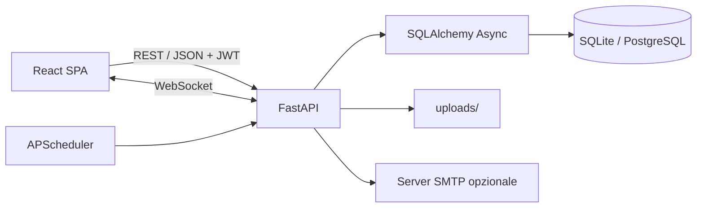
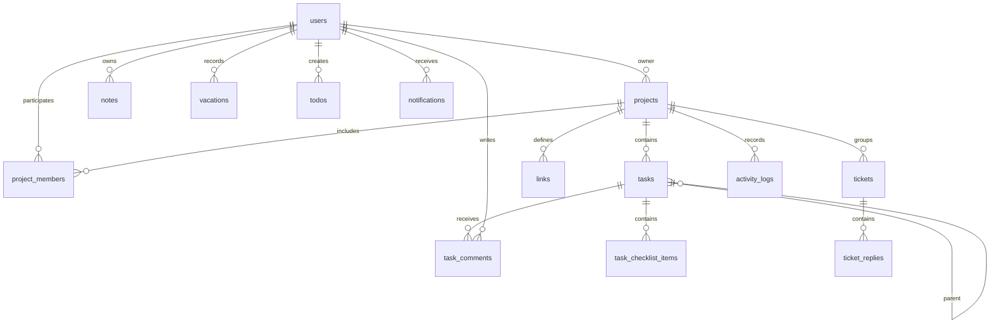

# Documentazione tecnica di HiPlan

Questa guida descrive l'architettura effettiva del repository, il modello dati principale, le API e il flusso di sviluppo. Le funzionalità non ancora implementate sono mantenute separatamente nella [roadmap](ROADMAP.md).

## 1. Architettura

HiPlan è composto da:

- una SPA React servita da Vite in sviluppo e da Nginx nel deployment Docker;
- un'API asincrona FastAPI;
- SQLAlchemy 2.0 con sessioni asincrone;
- SQLite per lo sviluppo locale oppure PostgreSQL nel deployment Docker;
- una directory locale `uploads` per gli allegati;
- un scheduler interno per backup e promemoria dei TODO.


```mermaid
flowchart LR
    Browser["React SPA"] -->|"REST / JSON + JWT"| API["FastAPI"]
    Browser <-->|"WebSocket"| API
    API --> ORM["SQLAlchemy Async"]
    ORM --> DB[("SQLite / PostgreSQL")]
    API --> Files["uploads/"]
    Scheduler["APScheduler"] --> API
    API --> SMTP["Server SMTP opzionale"]
```

### Flussi principali

- Il client Axios aggiunge il bearer token alle richieste e gestisce il rinnovo della sessione.
- I router FastAPI validano gli input tramite schemi Pydantic.
- I servizi applicativi gestiscono autenticazione, progetti, task, export, email e backup.
- Il Gantt carica task e link con un unico payload compatibile con DHTMLX.
- Le modifiche rilevanti possono produrre record nel registro attività, notifiche e messaggi WebSocket.
- Gli allegati vengono salvati su filesystem; nel database è memorizzato il relativo metadato serializzato.

## 2. Stack

### Backend

| Componente | Utilizzo |
| --- | --- |
| FastAPI `0.115.*` | API REST, dipendenze e OpenAPI |
| Uvicorn `0.34.*` | Server ASGI |
| SQLAlchemy `2.0.*` | ORM asincrono |
| Pydantic Settings `2.7.*` | configurazione da ambiente |
| `python-jose` | creazione e verifica dei JWT |
| `bcrypt` | hashing delle password |
| APScheduler | backup e controllo periodico dei TODO |
| aiosmtplib | notifiche email opzionali |
| OpenPyXL / ReportLab | export Excel e PDF |

### Frontend

| Componente | Utilizzo |
| --- | --- |
| React 19 | componenti e stato della SPA |
| React Router 7 | navigazione e protezione delle rotte |
| Axios | comunicazione HTTP |
| DHTMLX Gantt 10 | diagramma di Gantt e dipendenze |
| Vite 5 | sviluppo e build |
| Oxlint | analisi statica JavaScript/JSX |
| CSS | design system, temi e layout responsive |

## 3. Struttura del codice

```text
backend/app/
├── main.py                 # applicazione, lifespan, scheduler e router
├── api/
│   ├── auth.py             # registrazione, login e refresh
│   ├── users.py            # profilo, utenti, task del giorno e conflitti
│   ├── projects.py         # commesse, membri, allegati e backup
│   ├── tasks.py            # task, milestone, Gantt e link
│   ├── task_collaboration.py
│   ├── workload.py
│   ├── vacations.py
│   ├── notes.py
│   ├── todos.py
│   ├── tickets.py
│   ├── notifications.py
│   ├── activity_logs.py
│   ├── phase_templates.py
│   ├── export.py
│   ├── settings.py
│   ├── email_logs.py
│   └── websockets.py
├── core/                   # config, sicurezza, dipendenze e WebSocket
├── models/                 # entità SQLAlchemy
├── schemas/                # payload Pydantic
├── services/               # logica applicativa
└── utils/working_days.py   # calendario lavorativo

frontend/src/
├── api/client.js
├── components/
│   ├── gantt/
│   ├── calendar/
│   ├── workload/
│   ├── projects/
│   ├── tasks/
│   └── layout/
├── context/
├── hooks/
├── pages/
└── utils/
```

## 4. Modello dati

Gli identificatori applicativi sono UUID memorizzati come `String(36)` su SQLite e come UUID nativi su PostgreSQL.


```mermaid
erDiagram
    users ||--o{ projects : owner
    users ||--o{ project_members : participates
    projects ||--o{ project_members : includes
    projects ||--o{ tasks : contains
    projects ||--o{ links : defines
    tasks ||--o{ tasks : parent
    tasks ||--o{ task_comments : receives
    tasks ||--o{ task_checklist_items : contains
    users ||--o{ task_comments : writes
    users ||--o{ notes : owns
    users ||--o{ vacations : records
    users ||--o{ todos : creates
    projects ||--o{ tickets : groups
    tickets ||--o{ ticket_replies : contains
    projects ||--o{ activity_logs : records
    users ||--o{ notifications : receives
```

### `users`

Campi principali:

- email e username univoci;
- password hash;
- nome completo;
- ruolo `admin`, `editor` o `viewer`;
- reparto;
- stato attivo.

### `projects` e `project_members`

Una commessa contiene codice, cliente testuale, colore, nome, descrizione, note, date, allegati, stato, proprietario, responsabile e addetti assegnati. `project_members` rappresenta membri espliciti con ruolo di progetto.

Gli addetti della commessa sono attualmente serializzati come lista JSON nel campo testuale `assigned_workers`.

### `tasks`

Il modello `Task` rappresenta:

- task di progetto;
- fasi operative;
- milestone;
- gerarchie tramite `parent_id`.

Contiene date, durata, progresso, priorità, ordinamento, budget ore, reparto e stato di completamento.

I campi `workers`, `worker_hours` e `actual_hours` sono memorizzati come JSON in colonne testuali:

- `workers`: username assegnati;
- `worker_hours`: ore pianificate per addetto;
- `actual_hours`: ore consuntive per addetto e data.

`has_vacation_conflict` mantiene il flag di sovrapposizione con periodi di ferie.

In creazione e modifica, una sovrapposizione con le ferie non produce un errore di validazione. `schedule_assignment_at_earliest_capacity` costruisce la capacità giornaliera già occupata sulle commesse operative, distribuisce `worker_hours` nei primi slot da massimo 8 ore disponibili e salta ferie e giorni non lavorativi. Le date della fase vengono ampliate o traslate in base alla prima e all'ultima allocazione; l'eventuale slittamento viene propagato alle dipendenze come delta temporale.

### `links`

Collega una task sorgente a una task target nello stesso progetto. Supporta:

- Finish-to-Start (`FS`);
- Start-to-Start (`SS`);
- Finish-to-Finish (`FF`);
- Start-to-Finish (`SF`);
- ritardo numerico `lag`.

### Collaborazione

- `task_comments`: commenti contestuali con autore.
- `task_checklist_items`: voci spuntabili della fase.
- `notifications`: messaggi per utente, lettura e collegamento opzionale a progetto/task.
- `activity_logs`: storico delle azioni sulla commessa.

### Organizzazione personale

- `notes`: contenuto, visibilità e allegati di una nota.
- `todos`: assegnatari, date di notifica/scadenza, allegati e flag di invio.
- `vacations`: intervalli di ferie per utente.

### Ticket e configurazione

- `tickets` e `ticket_replies`: richiesta, stato, priorità, partecipanti, messaggi e allegati.
- `phase_templates`: denominazioni e colori predefiniti per reparto.
- `settings`: configurazioni applicative serializzate.
- `email_logs`: esito delle email inviate.

### Nota sulla normalizzazione

Alcuni insiemi sono memorizzati come JSON testuale per compatibilità e semplicità operativa. Questa scelta rende più difficili query, vincoli e aggiornamenti parziali. Eventuali evoluzioni verso costi, competenze o analytics avanzati dovrebbero valutare tabelle normalizzate e migrazioni retrocompatibili.

## 5. API

Tutte le rotte applicative usano il prefisso `/api`. La specifica completa e aggiornata è generata automaticamente in `/docs`.

### Autenticazione e utenti

| Metodo | Endpoint | Funzione |
| --- | --- | --- |
| `POST` | `/api/auth/register` | registra un account |
| `POST` | `/api/auth/login` | restituisce access e refresh token |
| `POST` | `/api/auth/refresh` | rinnova la coppia di token |
| `GET` | `/api/users/me` | profilo corrente |
| `PATCH` | `/api/users/me` | aggiorna il profilo |
| `GET` | `/api/users` | elenca gli utenti |
| `PATCH` | `/api/users/{id}` | amministrazione utente |
| `POST` | `/api/users/{id}/reset-password` | reset password amministrativo |
| `GET` | `/api/users/me/tasks/today` | attività odierne dell'utente |
| `GET` | `/api/users/conflicts` | sovrapposizioni degli addetti |

### Commesse e Gantt

| Metodo | Endpoint | Funzione |
| --- | --- | --- |
| `GET/POST` | `/api/projects` | elenco o creazione commesse |
| `GET/PUT/DELETE` | `/api/projects/{id}` | dettaglio, modifica o eliminazione |
| `POST/DELETE` | `/api/projects/{id}/members...` | membri del progetto |
| `POST/DELETE` | `/api/projects/{id}/attachments...` | allegati |
| `GET` | `/api/projects/{id}/gantt` | task e link |
| `POST` | `/api/projects/{id}/tasks` | crea fase o milestone |
| `PUT/DELETE` | `/api/projects/{id}/tasks/{task_id}` | modifica o elimina task |
| `POST` | `/api/projects/{id}/links` | crea dipendenza |
| `DELETE` | `/api/projects/{id}/links/{link_id}` | elimina dipendenza |
| `GET` | `/api/projects/{id}/activity_logs` | registro attività |
| `GET` | `/api/projects/{id}/rescheduling` | criticità della commessa, dry-run globale con modifiche proposte e storico ripianificazioni |
| `POST` | `/api/projects/{id}/rescheduling/apply` | rianalizza lo scenario globale e applica subito il batch, includendo manualmente la commessa corrente anche se in pausa |
| `POST` | `/api/projects/{id}/rescheduling/pause` | sospende o riattiva l'agente sulla commessa |
| `POST` | `/api/projects/{id}/rescheduling/{run_id}/undo` | rollback controllato |
| `GET` | `/api/workload/heatmap` | carichi di lavoro |

L'`AsyncIOScheduler`, configurato sul fuso `Europe/Rome`, avvia l'agente poco dopo l'avvio del backend e ogni giorno alle 01:15. `analyze_all_projects` raccoglie gli scenari di tutte le commesse operative non in pausa e `run_daily_rescheduling` li applica in un'unica transazione globale. L'analisi considera esclusivamente giornate concluse e filtra le ore consuntivate per data, impedendo a registrazioni odierne o future di coprire deficit precedenti. Ogni deficit incrementale viene aggregato per addetto e convertito in giorni di capacità da 8 ore; una seconda esecuzione senza nuovi deficit non crea un altro batch. Le fasi correnti e future dell'addetto vengono spostate su tutte le commesse `planning` o `active`. Le dipendenze propagano il delta temporale effettivo della sorgente, inclusi gli ulteriori giorni saltati per ferie, preservando offset e sovrapposizioni. Le commesse con `planning_agent_paused` sono escluse e protette. Le righe `planning_runs` prodotte sulle diverse commesse condividono un `batch_id`, usato per audit e rollback atomico dell'intervento completo.

`preview_rescheduling` richiama lo stesso motore con `dry_run=True`: costruisce modifiche, allocazioni e riepilogo multi-commessa, quindi esegue il rollback della sessione prima di restituire l'anteprima. L'endpoint `GET` può quindi essere richiamato ogni volta che il box viene visualizzato senza produrre effetti persistenti. L'applicazione manuale esegue comunque una nuova analisi globale immediatamente prima del commit.

### Collaborazione e operatività

| Risorsa | Prefisso |
| --- | --- |
| commenti e checklist | `/api/projects/{project_id}/tasks/{task_id}` |
| notifiche | `/api/notifications` |
| note | `/api/notes` |
| TODO | `/api/todos` |
| ferie | `/api/vacations` |
| ticket | `/api/tickets` |
| template di fase | `/api/phase-templates` |
| WebSocket | `/api/ws` |

### Export, backup e impostazioni

| Metodo | Endpoint | Funzione |
| --- | --- | --- |
| `GET` | `/api/projects/{id}/export/pdf` | export PDF di una commessa |
| `GET` | `/api/projects/{id}/export/excel` | export Excel di una commessa |
| `POST` | `/api/projects/export-list/{formato}` | export di più commesse |
| `GET` | `/api/tickets/{id}/export/{formato}` | export ticket |
| `GET/POST/DELETE` | `/api/settings/global-banner...` | annunci globali |
| `GET/PUT` | `/api/settings/ticket_phases` | configurazione ticket |
| `GET` | `/api/settings/backup/status` | ultimo backup |
| `GET` | `/api/admin/email-logs/` | registro email |

## 6. Autenticazione e autorizzazione

Al login vengono emessi:

- access token con durata predefinita di 30 minuti;
- refresh token con durata predefinita di 7 giorni.

I token sono firmati con `HS256`. La chiave è letta da `SECRET_KEY`.

Le dipendenze FastAPI recuperano l'utente attivo e, dove necessario, richiedono un ruolo specifico. Anche il frontend protegge le rotte, ma il controllo autorevole deve sempre rimanere nel backend.

### Configurazione di sicurezza

Prima del deployment:

- impostare una `SECRET_KEY` casuale e non versionata;
- sostituire le credenziali amministrative predefinite;
- limitare `CORS_ORIGINS`;
- non usare le password presenti nel file Docker di esempio;
- esporre l'applicazione tramite HTTPS;
- proteggere database, backup e directory degli allegati.

## 7. Scheduler, email e backup

Nel lifespan di FastAPI viene avviato APScheduler:

- backup automatico ogni domenica alle 03:00;
- controllo dei TODO ogni cinque minuti.

Il controllo TODO crea notifiche in-app quando arriva la data programmata o la scadenza è vicina. Se `notify_email` è attivo e SMTP è configurato, viene inviata anche un'email e registrato l'esito.

Il backup JSON versione 2 include utenti, impostazioni, template di fase, commesse, membri, task, note, ferie, notifiche, link, commenti e checklist. Non include ancora ticket e risposte, TODO, log email o i file fisici degli allegati; per un ripristino completo dell'ambiente è necessario salvare anche il database e la directory degli upload.

Il job automatico crea uno ZIP con `backend/ganttflow.db` e `backend/uploads`, mantenendo gli ultimi quattro archivi. È quindi efficace per l'installazione SQLite locale, ma non esegue alcun dump di PostgreSQL. Inoltre gli archivi restano sullo stesso host: un deployment di produzione deve prevedere dump PostgreSQL e copie esterne dei backup.

L'esecuzione dello scheduler all'interno del processo web è adatta all'installazione corrente a singola istanza. Con più worker o repliche produrrebbe job duplicati: in quel caso occorre spostare i job in un worker dedicato o adottare un lock distribuito.

## 8. Allegati

FastAPI espone `/uploads` come contenuto statico. I file vengono salvati nella directory `uploads` relativa al processo backend.

Considerazioni operative:

- il volume degli upload deve essere persistente in Docker;
- il backup JSON non sostituisce il backup dei file;
- dimensione, estensioni e scansione antivirus vanno configurate in base all'ambiente;
- in installazioni distribuite è preferibile uno storage condiviso o object storage.

## 9. Configurazione

Le variabili principali sono:

```dotenv
DATABASE_URL=sqlite+aiosqlite:///./ganttflow.db
SECRET_KEY=replace-me
ALGORITHM=HS256
ACCESS_TOKEN_EXPIRE_MINUTES=30
REFRESH_TOKEN_EXPIRE_DAYS=7
CORS_ORIGINS=["http://localhost:5173"]
DEBUG=true

SMTP_HOST=
SMTP_PORT=587
SMTP_USER=
SMTP_PASSWORD=
SMTP_FROM=
SMTP_USE_TLS=true
```

Usare `backend/.env.example` come riferimento e non committare segreti reali.

## 10. Sviluppo locale

### Backend

```bash
cd backend
python3 -m venv venv
source venv/bin/activate
pip install -r requirements.txt
python -m uvicorn app.main:app --host 0.0.0.0 --port 8000 --reload
```

Su Windows:

```powershell
cd backend
python -m venv venv
venv\Scripts\activate
pip install -r requirements.txt
python -m uvicorn app.main:app --host 0.0.0.0 --port 8000 --reload
```

### Frontend

```bash
cd frontend
npm install
npm run dev
```

Vite ascolta su tutte le interfacce alla porta `5173`. Non è definito un proxy nel file `vite.config.js`; la destinazione API è determinata dal client in `frontend/src/api/client.js`.

Il toolchain frontend richiede Node.js `20.19` o successivo.

### Stato delle dipendenze frontend

Le dipendenze dirette vengono mantenute sulle versioni compatibili più recenti verificate dal progetto. Vite è fissato alla serie `6.4.x` e React Router alla versione `7.18.2`.

Al 29 luglio 2026 `npm audit` segnala ancora `GHSA-qwww-vcr4-c8h2` per React Router. L'avviso riguarda l'uso di React Server Components e Server Actions; HiPlan usa `BrowserRouter` come SPA client-side e non espone quelle funzionalità, quindi il percorso vulnerabile non è attivo nell'applicazione. Non esiste ancora una release pubblica successiva non segnalata: l'eccezione va rivalutata a ogni aggiornamento del lockfile.

## 11. Database e migrazioni

All'avvio, l'applicazione esegue `Base.metadata.create_all()` e alcune aggiunte di colonne compatibili con installazioni precedenti. Il repository include Alembic tra le dipendenze, ma il flusso di migrazione non è ancora applicato uniformemente.

Per evoluzioni del modello dati:

1. creare una migrazione esplicita e reversibile;
2. provarla su una copia del database;
3. verificare sia SQLite sia PostgreSQL;
4. documentare eventuali conversioni dei campi JSON testuali;
5. predisporre backup e procedura di rollback.

## 12. Test e qualità

```bash
cd backend
pytest

cd ../frontend
npm run lint
npm run build
```

I test backend coprono autenticazione, utenti, progetti e conflitti ferie. Ogni nuova funzione dovrebbe aggiungere test per autorizzazione, validazione, casi limite temporali e migrazioni.

Prima di una release è inoltre consigliato verificare:

- login, refresh e ruoli;
- CRUD commessa e fase;
- dipendenze del Gantt;
- ore pianificate e consuntive;
- ferie e conflitti;
- upload e download degli allegati;
- export PDF/Excel;
- backup e ripristino in un ambiente isolato;
- invio email con un server SMTP di test.

## 13. Deployment

`docker-compose.yml` avvia:

- PostgreSQL 16;
- backend FastAPI sulla porta `8000`;
- frontend Nginx sulla porta `80`.

```bash
docker compose up -d --build
```

La configurazione fornita è un punto di partenza per ambienti controllati. Per produzione servono segreti esterni, HTTPS, backup dei volumi, persistenza degli upload, logging, monitoraggio e una politica di aggiornamento delle migrazioni.

Per le procedure di rete e installazione consultare la [guida al deployment](DEPLOYMENT_GUIDE.md).
