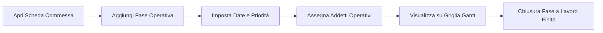
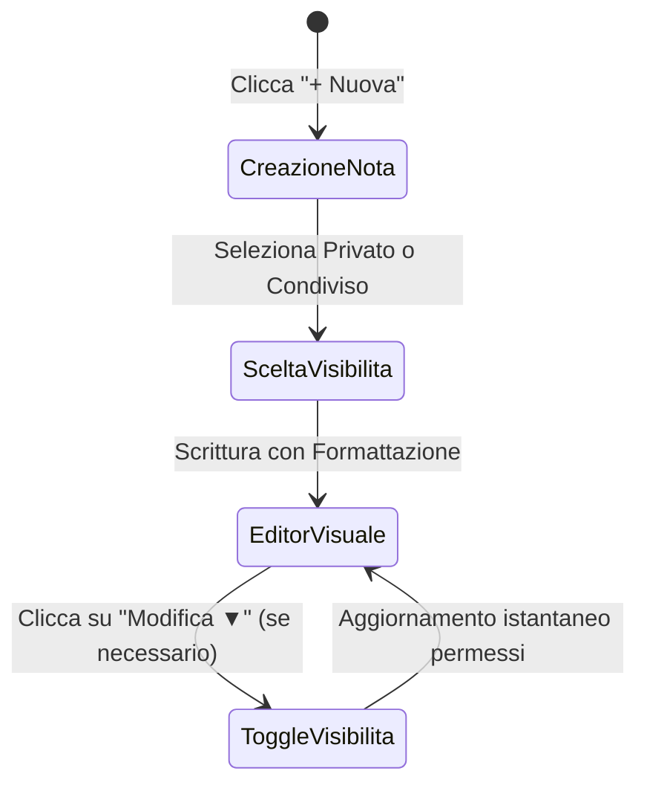

# 📖 Guida Utente Completa — GanttFlow

Benvenuti nella **Guida Utente di GanttFlow **, la piattaforma web aziendale interattiva progettata per la pianificazione operativa delle commesse, il monitoraggio delle fasi temporali tramite diagramma di Gantt, la pianificazione del personale su calendario e la collaborazione tramite blocchi note in stile Notion.

---

## 👥 1. I Ruoli nella Piattaforma

La piattaforma adotta un sistema di autorizzazioni basato sui ruoli per garantire che ogni membro dell'azienda acceda solo agli strumenti idonei alle proprie mansioni:

| Ruolo                                          | Icona | Descrizione e Poteri                                                                                                                                                                                                                                                                                 |
| :--------------------------------------------- | :---: | :--------------------------------------------------------------------------------------------------------------------------------------------------------------------------------------------------------------------------------------------------------------------------------------------------- |
| **Amministratore (Admin)**                     |  👑   | Accesso totale. Può creare progetti, modificare ogni fase, gestire gli utenti del sistema, modificare i permessi e amministrare l'anagrafica centralizzata degli addetti operativi nel pannello `Admin`. _Nota: Il primo utente che si registra nel sistema diventa automaticamente Amministratore._ |
| **Editor**                                     |  🚀   | Può creare clienti e commesse, aggiungere e modificare le fasi temporali, assegnare gli addetti, chiudere le fasi completate e gestire la timeline.                                                                                                                                                  |
| **Operatore / Visualizzatore (Viewer/Worker)** |  👥   | Membro del team operativo. Può consultare la lista dei progetti, esplorare il diagramma di Gantt e verificare i propri turni sul Calendario operativo. Può inoltre creare appunti privati o collaborare sulle note condivise.                                                                        |

---

## 🔑 2. Accesso e Primi Passi

### Accesso alla Piattaforma (`/login`)

1. Apri il browser web all'indirizzo dell'applicazione (es. `http://localhost:5173` o l'indirizzo del server aziendale).
2. Se sei un nuovo utente, clicca sul link **"Non hai un account? Registrati"**, inserisci il tuo nome completo, indirizzo email e una password sicura.
3. Se possiedi già le credenziali, inserisci **Email** e **Password** e premi su **"Accedi"**.

### Il Menu di Navigazione Laterale

A sinistra dello schermo troverai sempre il menu principale per muoverti agevolmente tra le sezioni:

- **`◫ Dashboard`**: Panoramica sintetica dell'andamento aziendale.
- **`☰ Progetti`**: Catalogo di tutte le commesse e gestione fasi.
- **`▦ Calendario`**: Vista mensile delle attività e filtro turni per singolo addetto.
- **`▤ Blocchi Note`**: Appunti intelligenti con formattazione e check-list collaborative.
- **`⚙ Admin`** _(visibile solo agli Amministratori)_: Pannello di gestione utenti e addetti.

---

## ◫ 3. La Dashboard Principale

La **Dashboard** è la schermata di accoglienza e offre uno sguardo immediato sullo stato di salute della produzione aziendale:

- **Contatori Rapid (KPI)**: Visualizzi istantaneamente il numero totale dei **Progetti Attivi**, delle **Fasi Aperte in Lavorazione** e dei **Progetti Completati al 100%**.
- **Commesse in Corso**: Una lista interattiva dei progetti aperti con barra progressiva visuale che ti permette di accedere rapidamente al dettaglio di ciascuno.
- **Fasi in Scadenza o Critiche**: Un pannello di avviso che ti mette in evidenza le fasi operative con priorità `Critica` o `Alta` la cui data di termine si avvicina, consentendoti di intervenire tempestivamente.

---

## ☰ 4. Gestione Clienti e Commesse

### Creazione di una Nuova Commessa

1. Naviga nella sezione **`☰ Progetti`**.
2. In alto a destra, clicca sul pulsante **`+ Nuova Commessa`**.
3. Compila i campi richiesti:
   - **Nome Progetto**: Il titolo identificativo della commessa (es. _Impianto Fotovoltaico Sede Centrale_).
   - **Cliente**: Seleziona il cliente dal menu a tendina. Se il cliente non esiste ancora, clicca sul pulsante **`+ Nuovo Cliente`** per aggiungerlo all'istante specificando ragione sociale, email e contatti.
   - **Descrizione e Note**: Eventuali specifiche di commessa o riferimenti contrattuali.
4. Clicca su **"Salva Commessa"** per crearla e accedere alla sua scheda operativa.

---

## 📅 5. Scheda Commessa e Diagramma di Gantt

Entrando all'interno di una singola commessa (`ProjectDetailPage`), avrai a disposizione un doppio strumento di pianificazione: la **Lista Fasi Operative** e il **Diagramma di Gantt & Timeline Interattiva**.

### Aggiunta e Gestione delle Fasi

Per suddividere la commessa in tappe operative:

1. Clicca sul pulsante **`+ Aggiungi Fase`**.
2. **Titolo della Fase**: Es. _Posa Cavi e Cablaggio_, _Collaudo Finale_.
3. **Date di Inizio e Fine**: Definiscono la finestra temporale lavorativa.
4. **Priorità**: Scegli tra `Bassa`, `Media`, `Alta` e `Critica`. La priorità determina il colore visivo e la marcatura d'urgenza.
5. **Assegnazione Addetti**: Seleziona uno o più operatori dalla lista degli addetti disponibili (es. _Marco Rossi_, _Luca Bianchi_) che eseguiranno la lavorazione sul campo.
6. Clicca su **"Salva"**.

### Chiusura e Completamento di una Fase

Quando un team operativa conclude una fase di lavorazione:

1. Clicca sull'indicatore o sulla casella di stato della fase per contrassegnarla come **`Chiusa ✓`**.
2. Il sistema ricalcolerà automaticamente all'istante l'**avanzamento percentuale** dell'intera commessa (es. da 33% a 66%), aggiornando la barra verde sia nella scheda che nella Dashboard generale.

### La Visualizzazione Timeline e Gantt (`▤ Timeline`)

Cliccando sul pulsante **`▤ Timeline`** in alto a destra nella scheda commessa, la vista si trasforma nel **Diagramma di Gantt Interattivo**:

- **Selettore Griglia (Multi-Scala)**: Puoi cambiare la risoluzione della griglia temporale in qualsiasi momento per analizzare il lavoro sotto diverse prospettive:
  - **Giorni**: Vista ultra-dettagliata per il monitoraggio quotidiano.
  - **Settimane**: Vista operativa per organizzare i turni settimanali.
  - **Mesi**: Vista di pianificazione strategica per commesse a lungo termine.
- **Barre Visive e Addetti**: Ogni fase appare come una barra orizzontale colorata posizionata esattamente lungo il calendario, con indicati i nomi degli operatori assegnati per un controllo visivo immediato di chi fa cosa e quando.

---

## ▦ 6. Calendario Operativo e Turni del Personale

La pagina **`▦ Calendario`** offre una vista mensile globale di tutte le fasi operative in corso in azienda, disposte sulle singole giornate.

### Filtro Dinamico per Addetto

Per evitare sovraccarichi visivi e consentire a ogni operatore di consultare il proprio planning personale:

1. In alto nella pagina del Calendario, individua il menu a tendina **"Filtra per Addetto"**.
2. Seleziona il nome di un operatore (es. _Giuseppe Verdi_).
3. Il calendario si aggiornerà istantaneamente mostrando **esclusivamente le giornate e le fasi in cui quell'addetto è stato assegnato**, rendendo semplicissima la consultazione dei propri turni operativi settimanali e mensili.

---

## ▤ 7. Blocchi Note Interattivi (Stile Notion)

Il modulo **`▤ Blocchi Note`** è il quaderno di lavoro aziendale collaborativo, perfetto per appunti di riunione, check-list di collaudo, specifiche tecniche o documentazione di cantiere.

### Creazione e Formattazione Visuale WYSIWYG

1. Clicca su **`+ Nuova`** nella barra di sinistra del modulo Blocchi Note.
2. Inserisci il titolo della nota e scegli la visibilità iniziale: **`🔒 File Privato`** (visibile solo a te) oppure **`👥 In Condivisione con il Team`**.
3. All'apertura della nota, utilizza la **Barra di Formattazione Visuale** in alto per strutturare il documento senza dover conoscere alcun codice:
   - **`P Normale`**: Testo standard di paragrafo.
   - **`H1 Titolo` / `H2 Sottotitolo`**: Per dividere il documento in sezioni ben visibili.
   - **`Grassetto` / `Corsivo`**: Per evidenziare concetti chiave.
   - **`☑ Check-list [ ]`**: Crea una **lista di attività con vere caselle di spunta interattive**. Cliccando sulla casella di una voce completata, la spunta si attiva, il testo si sbarra automaticamente e il salvataggio avviene in tempo reale.
   - **`❝ Citazione` / `⟨/⟩ Codice`**: Per riquadrare note importanti o frammenti tecnici.

### Modifica della Visibilità in Tempo Reale

Hai creato una nota di lavoro come `🔒 Privata` e ora che è pronta vuoi condividerla con tutti i colleghi?

1. Apri la nota.
2. Nella barra superiore, accanto al nome dell'autore, clicca sul pulsante badge **`🔒 Privato (Modifica ▼)`** (o `👥 Condiviso`).
3. Dal menu a comparsa, seleziona la nuova impostazione (es. **In Condivisione**): il badge cambierà colore all'istante e la nota diventerà immediatamente visibile e consultabile dall'intero team, senza ricaricare la pagina!

---

## ⚙ 8. Pannello di Amministrazione (`Admin`)

Se possiedi il ruolo di **Amministratore**, avrai accesso alla pagina esclusiva **`⚙ Admin`** situata in fondo al menu laterale di sinistra. Questo pannello è suddiviso in due sezioni operative cruciali:

### 1. Gestione Utenti e Ruoli del Sistema

Qui trovi l'elenco completo delle persone registrate all'applicativo web (Email, Username, Nome Completo).

- Cliccando sul menu a tendina accanto al nome di un utente, puoi modificare il suo livello di privilegio in tempo reale:
  - Promuovere un `viewer` a **`Project Manager (pm)`** per abilitarlo alla creazione di commesse.
  - Elevare un utente ad **`Amministratore (admin)`**.
  - Retrocedere un utente in caso di cambio mansione.

### 2. Gestione Anagrafica Addetti Operativi

Per fare in modo che i Project Manager possano assegnare persone fisiche (tecnici, installatori, operai, consulenti) alle fasi delle commesse:

1. Scorri nella sezione **"Anagrafica Addetti Operativi"** del pannello Admin.
2. Digita il nome e cognome dell'operatore nel campo di testo (es. _Sandro Botticelli_) e clicca su **`+ Aggiungi Addetto`**.
3. Da quel momento, il nuovo nominativo sarà immediatamente selezionabile durante la creazione di qualsiasi fase operativa all'interno dei progetti e nel filtro del Calendario.
4. Per rimuovere un addetto non più in organico, ti basta cliccare sul pulsante rosso **`🗑️ Rimuovi`** accanto al suo nome.
